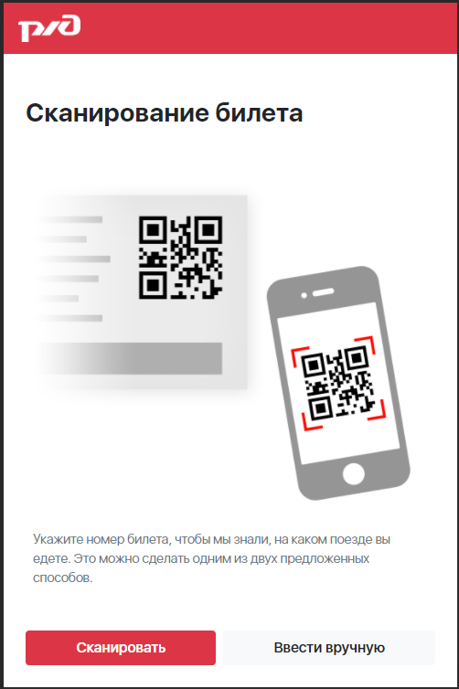
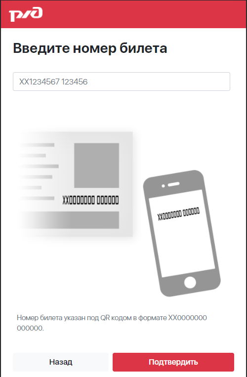
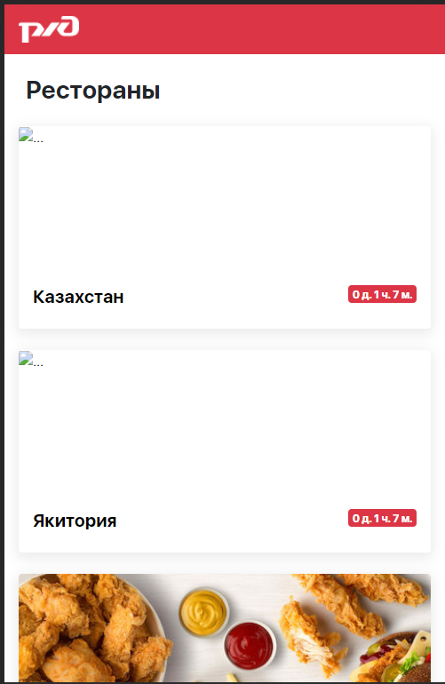
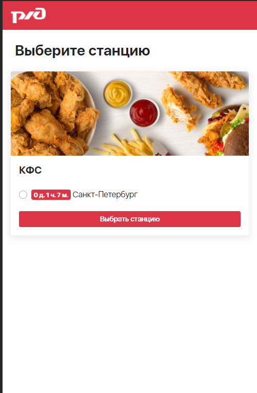
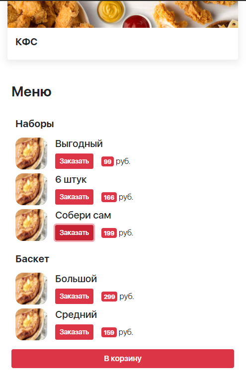
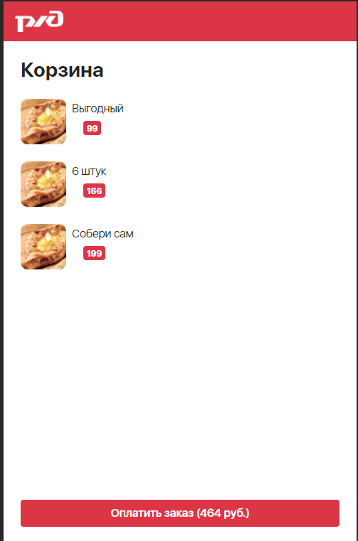
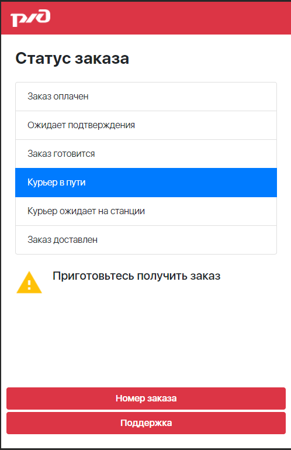

# RZHD - Цифровой прорыв Казань 2019  

## Проект с хакатона Цифровой прорыв  
    > Даты проведения: с 27 по 29 сентября 2019 года

### Состав команды  
- Александр Д.
- Александр Н.
- Александр С.
- Никита М.

### Описание проекта  

Кейс: создать приложение для заказа еды на вокзал во время твоей поездки  
Суть: ты едешь в поезде и проголадался? Тогда у тебя есть возможность заказать еду на следующую станцию  
Реализация: заходишь в приложение, вбиваешь билет, видишь доступные доставки и станции, на которые они доставляют по маршруту твоего следования (для этого и вводится билет). Соответственно, по билету берутся данные о том, когда ты будешь на какой станции, берётся среднее время доставки и делается рассчёт: если успеют - заказывай, не успеют - неактивная станция  

### Проект
1. При запуске попадаем на стартовую страницу, где мы можем отсканировать билет или ввести его вручную  
    
2. После выбора ручного ввода попадаем на страницу с полем для ввода билета  
    
3. После ввода билета пользователю показываются доставки, которые могут обслужить станции на маршрутре пользователя. А также время, когда пользователь получит свой заказ 
    > К сожалению, не все доставки имеют свои лого  

    
4. Выбрали ресторан. Теперь пользователю показываются станции, на которых работает тот или иной ресторан. А также время, когда пользователь получит свой заказ  
    
5. Делаем заказ  
    
6. Проверяем заказ  
    
7. Следим за статусом заказа и ждём  
    